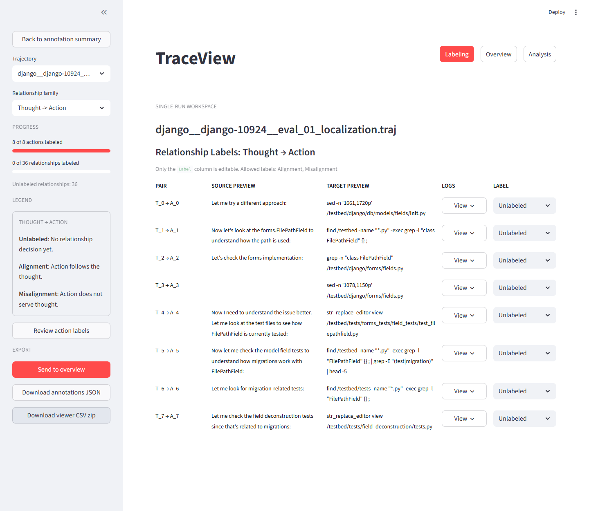

# TraceView Evaluation Instructions

Use this guide to evaluate TraceView from the perspective of someone labeling,
reviewing, and inspecting an agent trajectory.

## Background

Automatic program repair (APR) systems try to solve software bugs, including
GitHub issues in open-source software (OSS) projects. LLM-based APR systems often
work step by step: at each step they produce a thought, choose an action, and
receive environment feedback as a result.

TraceView is meant to help people who work with these systems better visualize
and understand that process: what the system did, what worked, and what did not.
It turns long text logs into a more intuitive interface for inspecting the
repair process.

## Evaluation Goal

Evaluate whether TraceView helps users:

- understand an agent trajectory at a high level
- label action categories and relationships efficiently
- move a labeled trajectory into Overview
- inspect a trajectory graph in Analysis
- understand where labels, relationships, and raw evidence come from

Focus on clarity, workflow friction, missing context, confusing labels, and places
where the app does not behave the way you expected.

## Before You Start

You should have one of the following:

- a running TraceView URL from the study organizer
- a local checkout from the anonymous
  [TraceView repository](https://anonymous.4open.science/r/agent-traj-visualization-8EF9/)
  with setup instructions from `README.md`
- the evaluator survey form open in a second tab or window

Recommended sample traces are available in `evaluation_samples/`. Each file is
an 8-step SWE-agent `.traj` window selected to keep labeling work manageable.

Keep the evaluator survey form open in a second tab or window. 

## Use The Survey During Evaluation

Fill out the survey as you work instead of waiting until the end. Complete the
consent and background questions before opening the trace. The remaining survey
sections line up with the tasks below:

- Use `TraceView` as the tool name in your answers.
- `Accuracy`: answer after ingest, action labeling, and relationship labeling.
- `Integrity`: answer after you can explain the agent's repair process.
- `Applicability`: answer after deciding whether this would fit your own APR debugging workflow.
- `Completeness`: answer after checking whether the UI provides enough evidence.
- `Efficiency`: answer while identifying a problematic step, node, relationship, or iteration.
- `Designs`: answer after moving between Overview, Iteration mode, Detailed mode, and raw evidence.

For timing questions, use the time recorded by the research team. If you are
self-evaluating, start the timer when you begin searching for problematic parts
of the trajectory in Analysis. Stop it when you can name the problematic step,
node, relationship, or iteration and explain why you chose it.

## Evaluation Task 1: First Impression And Navigation

1. Open TraceView.
2. Identify the main navigation buttons: `Labeling`, `Overview`, and `Analysis`.
3. Without reading the README, explain what you think each section does.
4. Click each navigation button once.
5. Return to `Labeling`.

Think about:

- section names
- where to start
- active page state
- state after navigation

Survey checkpoint:

- Note any navigation confusion for the later free-response questions about
  interface clarity and hierarchy.

## Evaluation Task 2: Ingest A Raw Trajectory

1. Go to `Labeling`.
2. Upload or paste one `.traj` file from the repository's
   `evaluation_samples/` directory e.g., `evaluation_samples/django__django-10924__eval_01_localization.traj`.
3. Continue into the annotation flow.

Think about:

- accepted file/input format
- upload or paste flow
- parser warnings
- parsed step count

Survey checkpoint:

- Use this screen to start judging `Accuracy`: whether the trajectory structure,
  node types, and iteration order are rendered in a way you can parse without
  guessing.

## Evaluation Task 3: Review The Completion Summary

After ingest, review the completion summary before entering the workspace.

1. Look at the coverage metrics.
2. Open each tab: `Summary`, `Behavior`, `Action Categories`, and `Issues`.
3. Use the `Open in single-run workspace` button.

Think about:

- coverage metrics
- tab names
- summary versus editing area
- next action

Survey checkpoint:

- Use the summary tabs to prepare answers about `Integrity`: whether the app
  helps you understand the agent's repair process as a whole.

## Evaluation Task 4: Label Action Categories

In the single-run workspace, start with action labeling.

1. Review the sidebar progress indicator.
2. Read the compact action-label legend in the sidebar.
3. Label at least the first five actions.
4. Open at least two `View` popovers to inspect raw thought/action/result logs.
5. If the provided sample is short, label all actions.
6. If the sample is long, label enough actions to judge the workflow.

Think about:

- required label order
- sidebar legend
- action previews
- `View` popovers
- label persistence
- scrolling

Survey checkpoint:

- In `Accuracy`, answer whether the action categories match what you infer from
  the raw action logs. Record any action category you disagreed with.

## Evaluation Task 5: Label Relationships

After action labeling is complete, continue to relationship labels.

1. Click `Continue to relationship labels`.
2. Use the sidebar to choose a relationship family.
3. Read the sidebar legend for the selected family.
4. Label at least five relationships.
5. Open at least two row-level `View` popovers to inspect full source and target logs.
6. Switch to another relationship family and repeat briefly.

Think about:

- transition from action labels
- selected relationship family
- allowed labels
- compact legend
- row-level `View` evidence
- remaining unlabeled items

Survey checkpoint:

- In `Accuracy`, answer whether typed relationships such as follow-up,
  contradiction, misinterpretation, and no influence match what you infer from
  the underlying trace.

## Evaluation Task 6: Export Or Send To Overview

When relationship labeling is available:

1. Review the export controls in the sidebar.
2. Send the labeled trajectory to `Overview`.
3. Optionally download the annotation JSON or viewer CSV zip.

Think about:

- export controls
- `Send to overview`
- download meanings
- transition to Overview

Survey checkpoint:

- Use this step to judge `Applicability`: whether the exported and overview-ready
  data would fit a real debugging or review workflow.

## Evaluation Task 7: Review The Run In Overview

In `Overview`:

1. Find the uploaded or labeled run.
2. Review the run summary.
3. Note whether the result is shown as unscored.
4. Open the run in `Analysis`.

Think about:

- finding the run
- unscored uploaded traces
- information density
- opening Analysis

Survey checkpoint:

- Use Overview to decide what the interface helps you understand that would have
  been hard to get from raw logs.

## Evaluation Task 8: Inspect The Graph In Analysis

Analysis starts in `Iteration` mode.

1. Confirm that `Iteration` mode is selected by default.
2. Start a timer.
3. Inspect the collapsed iteration graph.
4. Click an iteration node.
5. Review the inspector output.
6. Switch to `Detailed` mode.
7. Click a `Thought`, `Action`, or `Result` node.
8. Try at least one relation filter.
9. Adjust one layout control, such as node size or label length.
10. Stop the timer when you can identify a problematic step, node, relationship,
    or iteration and explain why it is problematic.

Think about:

- Iteration mode default
- collapsed iteration nodes
- inspector usefulness
- filters and layout controls
- graph readability
- separate inspector page

Survey checkpoint:

- In `Completeness`, answer whether the UI gave you enough evidence to judge
  where and why the run went wrong.
- In `Efficiency`, answer whether the visual encoding made it easy to
  distinguish normal progress from problematic transitions.
- In `Efficiency`, record how many minutes it took to identify the problematic
  part and describe what you looked at first.
- In `Designs`, answer whether the hierarchical view was useful and whether it
  helped you stay oriented while moving between overview, iteration groups,
  detailed nodes, relationships, and raw logs.

## Evaluation Task 9: Final Reflection

Use the remaining survey questions to summarize the evaluation:

1. Was anything rendered in a way that confused you or that you disagreed with?
2. Which part of the interface helped you understand the repair process most?
3. Which part contributed least?
4. What did the interface help you understand that would have been hard to get
   from raw logs?
5. Was there any information you expected to see but could not find?
6. How did you find the problematic step, node, relationship, or iteration?
7. What did you look at first?

Before submitting, check that the survey includes:

- consent, date, and background questions
- ratings for Accuracy, Integrity, Applicability, Completeness, Efficiency, and
  Designs
- the time, in minutes, it took to identify a problematic part of the trajectory
- a short walkthrough of how you found the problematic part
- at least one concrete note about missing, confusing, or misleading information

## Optional Severity Scale

Use this scale for issues:

- `Critical`: blocks completion of the evaluation task
- `High`: causes wrong interpretation or major workflow friction
- `Medium`: slows the evaluator down but has a workaround
- `Low`: polish, wording, or minor layout issue
