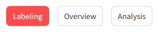
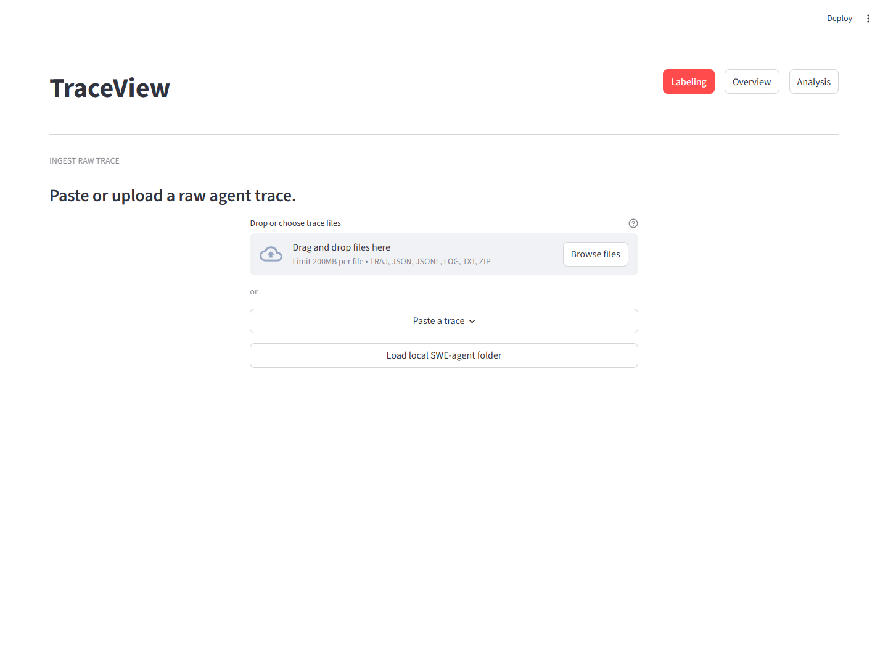
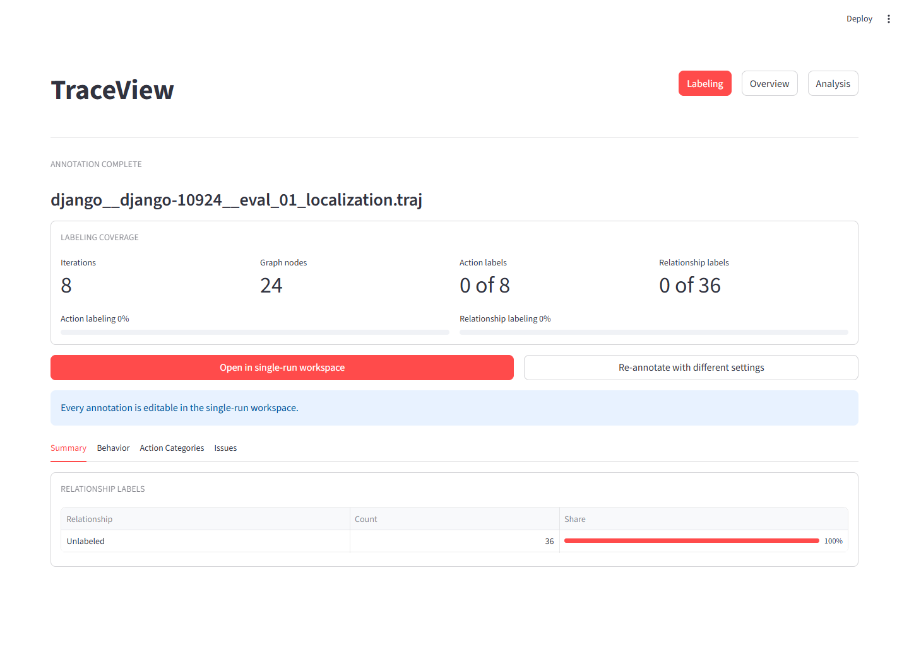
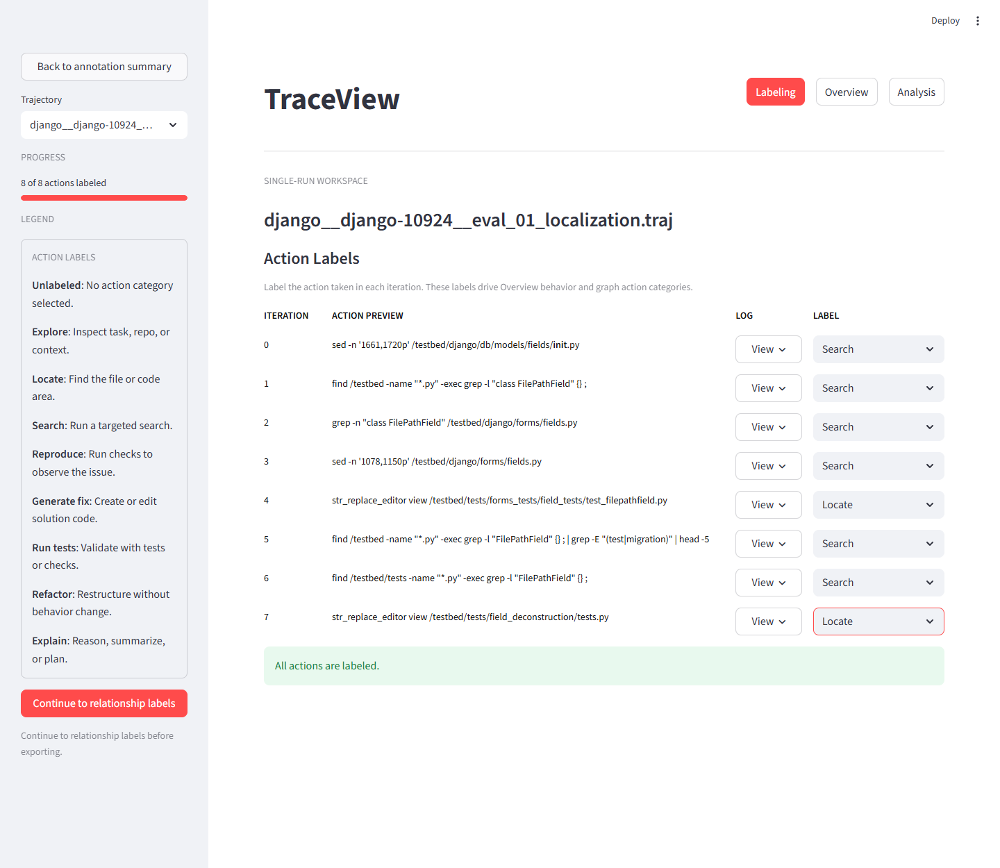
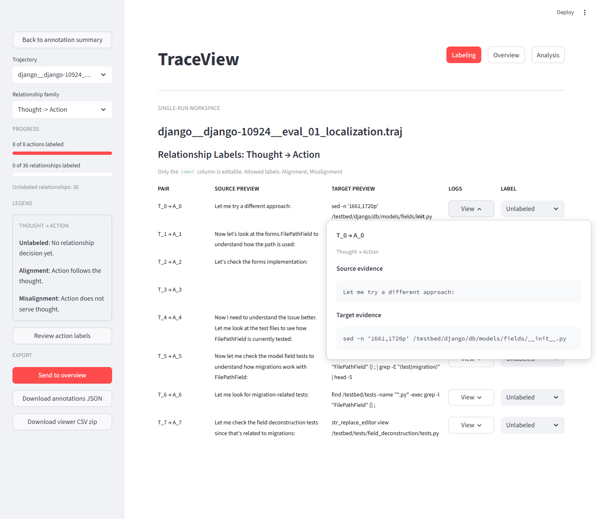
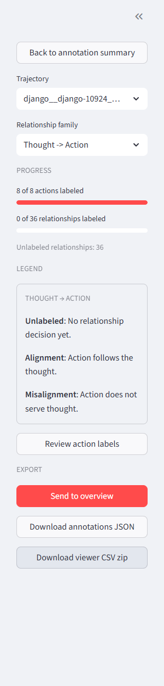
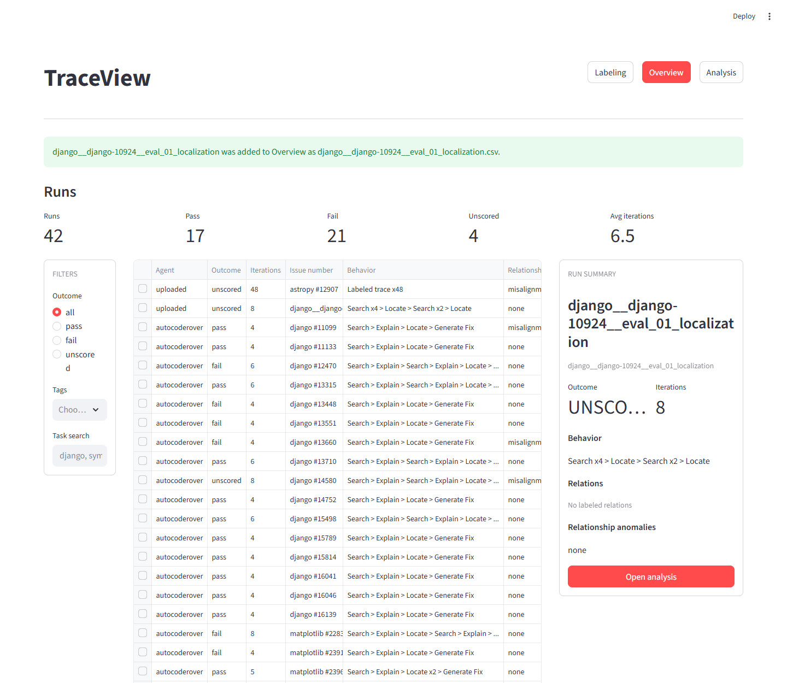
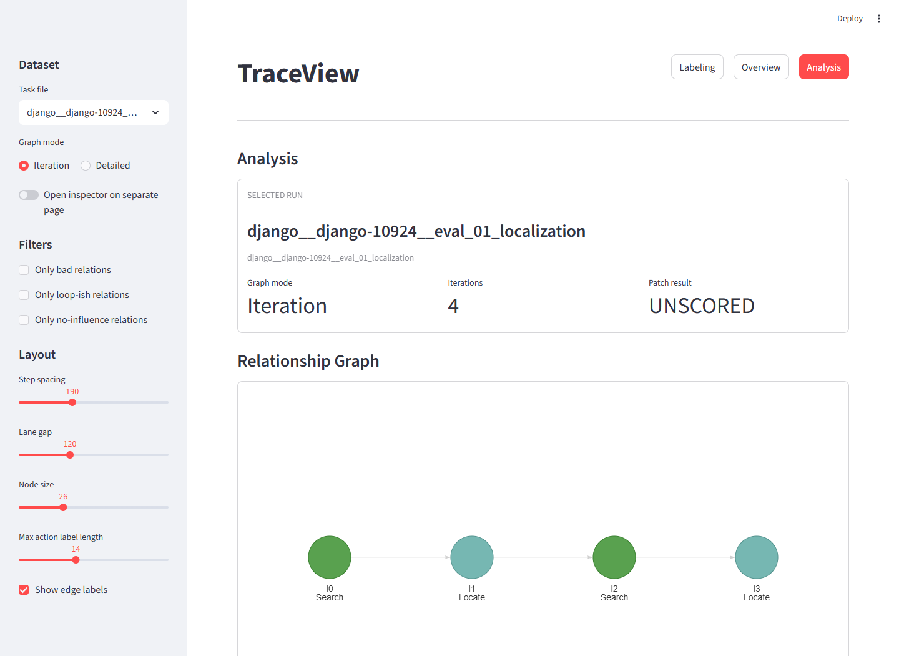
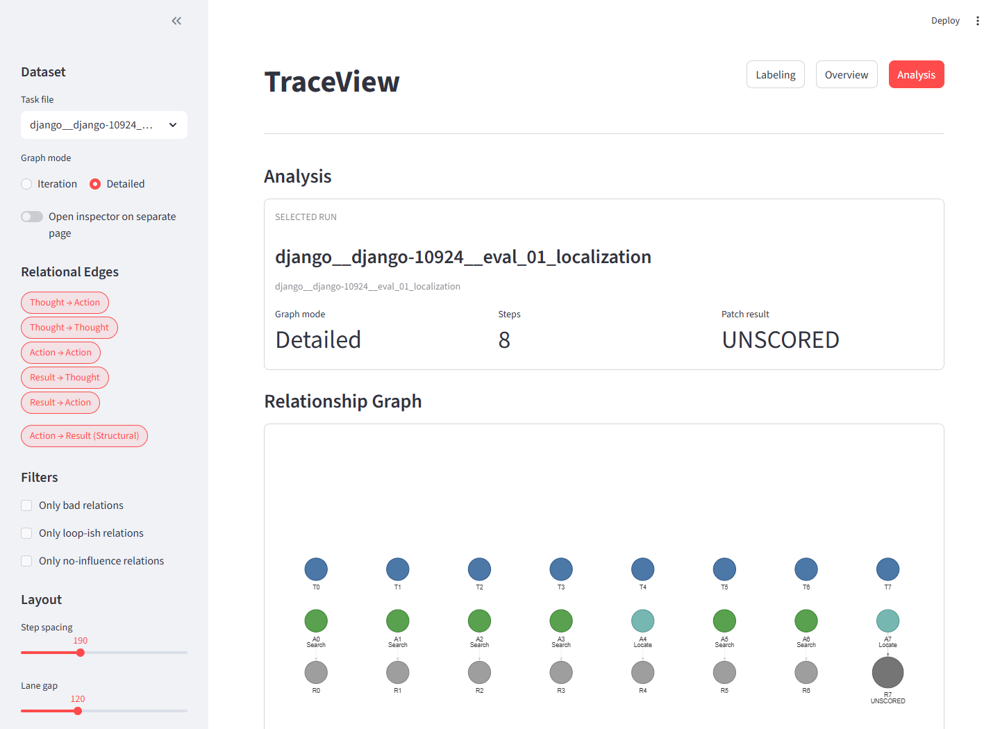

# TraceView Evaluation Instructions

Use this guide to evaluate TraceView from the perspective of someone labeling,
reviewing, and inspecting an agent trajectory.

## Evaluation Goal

Evaluate whether TraceView helps users:

- understand an agent trajectory at a high level
- label action categories and relationships efficiently
- move a labeled trajectory into Overview
- inspect a trajectory graph in Analysis
- understand where labels, relationships, and raw evidence come from

Focus on clarity, workflow friction, missing context, confusing labels, and places
where the app does not behave the way you expected.

## Before You Start

You should have one of the following:

- a running TraceView URL from the study organizer
- a local checkout with setup instructions from `README.md`
- the evaluator survey form open in a second tab or window

Recommended sample traces are available in `evaluation_samples/`. Each file is
an 8-step SWE-agent `.traj` window selected to keep labeling work manageable.

If running locally, start the app from the project root:

```shell
streamlit run traceview.py
```

Use a modern browser. Keep the browser window wide enough to see the graph and
sidebar comfortably.

## Use The Survey During Evaluation

Fill out the survey as you work instead of waiting until the end. Complete the
consent and background questions before opening the trace. The remaining survey
sections line up with the tasks below:

- Use `TraceView` as the tool name in your answers. If an older survey copy
  refers to `Loom` or a generic trajectory analysis tool, treat that as
  `TraceView`.
- `Accuracy`: answer after ingest, action labeling, and relationship labeling.
- `Integrity`: answer after you can explain the agent's repair process.
- `Applicability`: answer after deciding whether this would fit your own APR debugging workflow.
- `Completeness`: answer after checking whether the UI provides enough evidence.
- `Efficiency`: answer while identifying a problematic step, node, relationship, or iteration.
- `Designs`: answer after moving between Overview, Iteration mode, Detailed mode, and raw evidence.

For timing questions, start the timer when you begin searching for problematic
parts of the trajectory in Analysis. Stop it when you can name the problematic
step, node, relationship, or iteration and explain why you chose it.

## Evaluation Task 1: First Impression And Navigation

1. Open TraceView.
2. Identify the main navigation buttons: `Labeling`, `Overview`, and `Analysis`.
3. Without reading the README, explain what you think each section does.
4. Click each navigation button once.
5. Return to `Labeling`.



Evaluate:

- Are the three sections easy to understand?
- Is it clear where a new user should begin?
- Does the active page state look obvious?
- Does navigation preserve or reset state in a way that makes sense?

Survey checkpoint:

- Note any navigation confusion for the later free-response questions about
  interface clarity and hierarchy.

## Evaluation Task 2: Ingest A Raw Trajectory

1. Go to `Labeling`.
2. Upload or paste the provided trajectory sample.
3. If a local sample loader is available, you may use that instead.
4. Review any parser warnings.
5. Continue into the annotation flow.



Evaluate:

- Is it clear what file types or input formats are accepted?
- Is the upload/paste flow understandable?
- Are parser warnings readable and actionable?
- Is it clear how many steps were parsed?

Survey checkpoint:

- Use this screen to start judging `Accuracy`: whether the trajectory structure,
  node types, and iteration order are rendered in a way you can parse without
  guessing.

## Evaluation Task 3: Review The Completion Summary

After ingest, review the completion summary before entering the workspace.

1. Look at the coverage metrics.
2. Open each tab: `Summary`, `Behavior`, `Action Categories`, and `Issues`.
3. Use the `Open in single-run workspace` button.



Evaluate:

- Do the coverage metrics make sense?
- Are the tabs named clearly?
- Is it clear that the summary is a review page and not the main editing area?
- Is the primary next action easy to find?

Survey checkpoint:

- Use the summary tabs to prepare answers about `Integrity`: whether the app
  helps you understand the agent's repair process as a whole.

## Evaluation Task 4: Label Action Categories

In the single-run workspace, start with action labeling.

1. Review the sidebar progress indicator.
2. Read the compact action-label legend in the sidebar.
3. Label at least the first five actions.
4. Open at least two `View` popovers to inspect raw thought/action/result logs.
5. If the provided sample is short, label all actions.
6. If the sample is long, label enough actions to judge the workflow.



Evaluate:

- Is it clear that action labels must be completed before relationship labels?
- Is the sidebar legend useful without being too large?
- Are action previews long enough to make a decision?
- Is the `View` popover useful for longer logs?
- Do label selections persist immediately?
- Is scrolling manageable?

Survey checkpoint:

- In `Accuracy`, answer whether the action categories match what you infer from
  the raw action logs. Record any action category you disagreed with.

## Evaluation Task 5: Label Relationships

After action labeling is complete, continue to relationship labels.

1. Click `Continue to relationship labels`.
2. Use the sidebar to choose a relationship family.
3. Read the sidebar legend for the selected family.
4. Label at least five relationships.
5. Open at least two row-level `View` popovers to inspect full source and target logs.
6. Switch to another relationship family and repeat briefly.



Evaluate:

- Is the transition from action labels to relationship labels clear?
- Is the selected relationship family obvious?
- Are allowed labels understandable?
- Is the compact legend enough to make a labeling decision?
- Do the row-level `View` popovers provide enough source and target evidence?
- Is it clear what remains unlabeled?

Survey checkpoint:

- In `Accuracy`, answer whether typed relationships such as follow-up,
  contradiction, misinterpretation, and no influence match what you infer from
  the underlying trace.

## Evaluation Task 6: Export Or Send To Overview

When relationship labeling is available:

1. Review the export controls in the sidebar.
2. Send the labeled trajectory to `Overview`.
3. Optionally download the annotation JSON or viewer CSV zip.



Evaluate:

- Are export controls shown only when you expect them?
- Is `Send to overview` easy to find?
- Is it clear what each download contains?
- Does the transition to Overview feel successful?

Survey checkpoint:

- Use this step to judge `Applicability`: whether the exported and overview-ready
  data would fit a real debugging or review workflow.

## Evaluation Task 7: Review The Run In Overview

In `Overview`:

1. Find the uploaded or labeled run.
2. Review the run summary.
3. Note whether the result is shown as unscored.
4. Open the run in `Analysis`.



Evaluate:

- Is the uploaded/labeled run easy to find?
- Is it clear that uploaded traces do not have AutoCodeRover result metadata?
- Is the information dense enough without being overwhelming?
- Is opening Analysis discoverable?

Survey checkpoint:

- Use Overview to decide what the interface helps you understand that would have
  been hard to get from raw logs.

## Evaluation Task 8: Inspect The Graph In Analysis

Analysis starts in `Iteration` mode.

1. Confirm that `Iteration` mode is selected by default.
2. Start a timer.
3. Inspect the collapsed iteration graph.
4. Click an iteration node.
5. Review the inspector output.
6. Switch to `Detailed` mode.
7. Click a `Thought`, `Action`, or `Result` node.
8. Try at least one relation filter.
9. Adjust one layout control, such as node size or label length.
10. Stop the timer when you can identify a problematic step, node, relationship,
    or iteration and explain why it is problematic.





Evaluate:

- Is Iteration mode a useful default?
- Is it clear what a collapsed iteration node represents?
- Is the inspector useful in both graph modes?
- Are filters and layout controls understandable?
- Does the graph remain readable after changes?
- Is the separate inspector page option useful or confusing?

Survey checkpoint:

- In `Completeness`, answer whether the UI gave you enough evidence to judge
  where and why the run went wrong.
- In `Efficiency`, record how many minutes it took to identify the problematic
  part and describe what you looked at first.
- In `Designs`, answer whether the hierarchy helped you stay oriented while
  moving between overview, iteration groups, detailed nodes, relationships, and
  raw logs.

## Evaluation Task 9: Final Reflection

Use the remaining survey questions to summarize the evaluation:

1. What was the easiest part of the workflow?
2. What was the most confusing part?
3. Where did you need more context?
4. Where did the UI show too much information?
5. Where did the UI hide information you needed?
6. Would you trust the exported data? Why or why not?
7. What should be changed before using this with more evaluators?

Before submitting, check that the survey includes:

- the trace filename you evaluated
- ratings for Accuracy, Integrity, Applicability, Completeness, Efficiency, and
  Designs
- the time, in minutes, it took to identify a problematic part of the trajectory
- a short walkthrough of how you found the problematic part
- at least one concrete note about missing, confusing, or misleading information

## Optional Severity Scale

Use this scale for issues:

- `Critical`: blocks completion of the evaluation task
- `High`: causes wrong interpretation or major workflow friction
- `Medium`: slows the evaluator down but has a workaround
- `Low`: polish, wording, or minor layout issue
